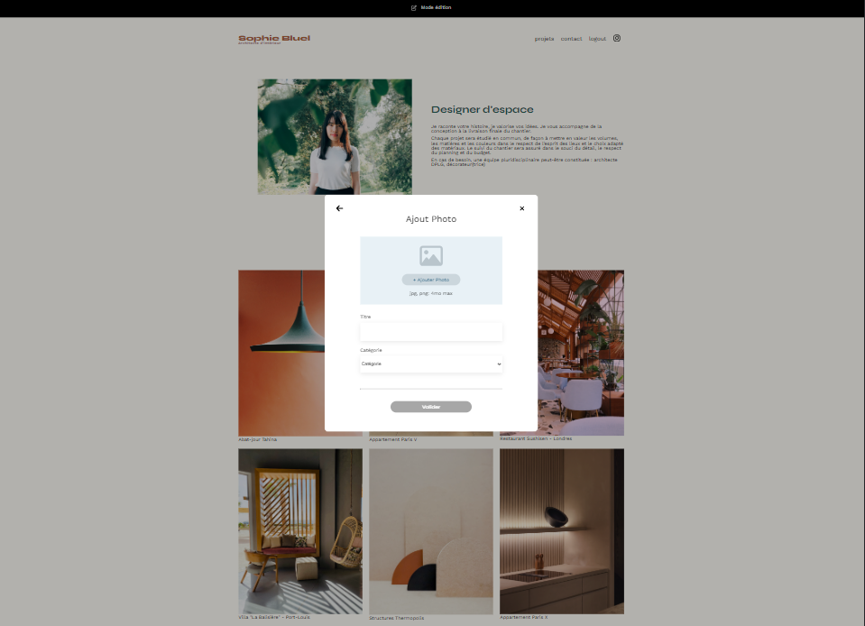

&nbsp;
# Sophie Bluel: Architect

&nbsp;
## Description

This project was my second professionalizing school project as part of a training course leading to a diploma. I was placed in a business context, in total autonomy, my work was validated by a jury.

Objective: Create a Dynamic web page with JavaScript using API

## Overview

## Assessed Skills

- Create a dynamic web page with JavaScript

- Retrieve user data in a JavaScript file via forms

- Manipulate DOM elements with JavaScript

- Handle user events with JavaScript

- Use of an API method GET / POST / DELETE

&nbsp;

&nbsp;
## Backend installation

> Clone the repo locally

> Navigate to the ``Backend`` directory

> To launch the API, run ``npm start``

## Test admin account

> email: sophie.bluel@test.tld

> password: S0phie 

## Info

> A backup of the backend is accessible from the repo, if you wish to use it, don't forget to initialize the dependencies with ``npm install``

&nbsp;

&nbsp;
## Mission Brief

> You work as a front-end developer for the ArchiWebos agency which has 50 employees.

> Having finished your last project with a little time to spare, you are sent as reinforcement as a front-end developer for a team working on designing the portfolio website of an interior architect.

> You must therefore develop: the presentation page of the architect's work;

> the site administrator login page

> the modals allowing the content to be updated
